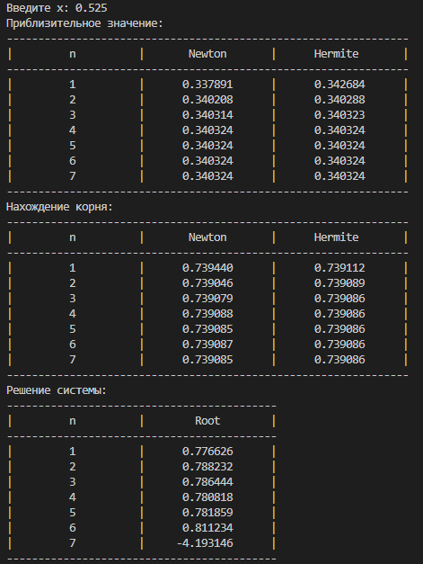

# Лабораторная работа №1
1. Получить таблицу значений y(x) при степенях полиномов Ньютона и Эрмита n= 1, 2, 3,
4 и 5 при фиксированном x, например, x=0.675 (середина интервала 0.6 - 0.75). Сравнить
результаты при одинаковых степенях .полиномов Ньютона и Эрмита.
2. Найти корень заданной выше табличной функции с помощью обратной интерполяции
обоими полиномами.
3. Решить систему нелинейных уравнений, основываясь на простой идее обратной интерполяции.

