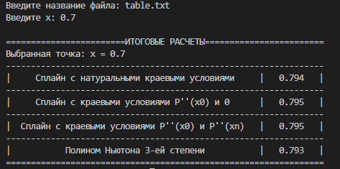

# Лабораторная работа №2
1. Разработать программу и тесты.
2. Предусмотреть 3 варианта задания условий на границах таблицы при x = x0 и x = xn:  
2.1 Естественные краевые условия, когда вторые производные сплайна равны нулю.  
2.2. На одной границе при x = x0 вторая производная сплайна равна второй производной 
полинома Ньютона третьей степени, а на другой границе по-прежнему вторая производная
равна нулю.  
2.3. На обеих границах при x = x0 и x = xn вторая производная сплайна равна второй
производной полинома Ньютона третьей степени.
3. Сравнить результаты интерполяции кубическим сплайном и полиномом Ньютона 3-ей
степени в середине и на краях таблицы.
4. Проанализировать влияние указанных способов задания краевых условий на результаты
вычислений.

